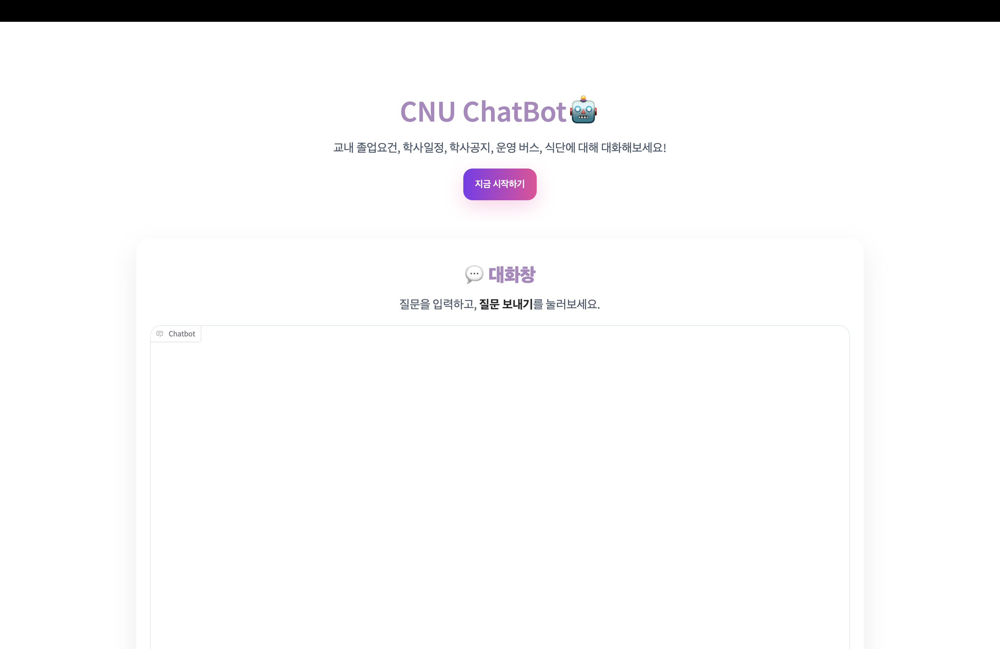
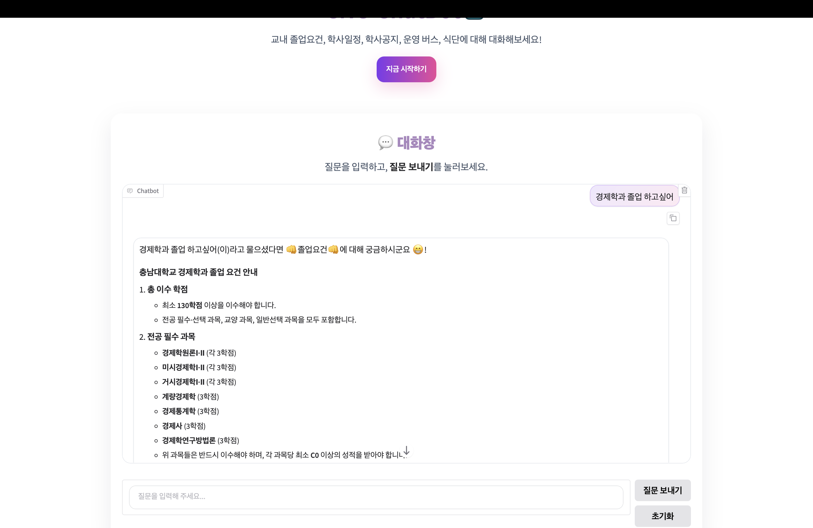
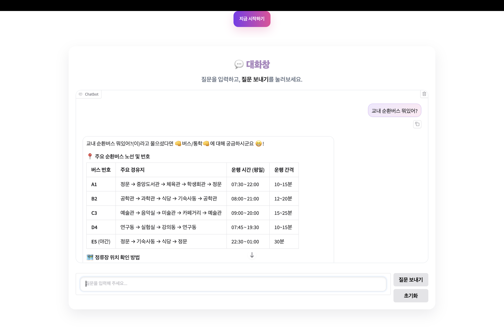
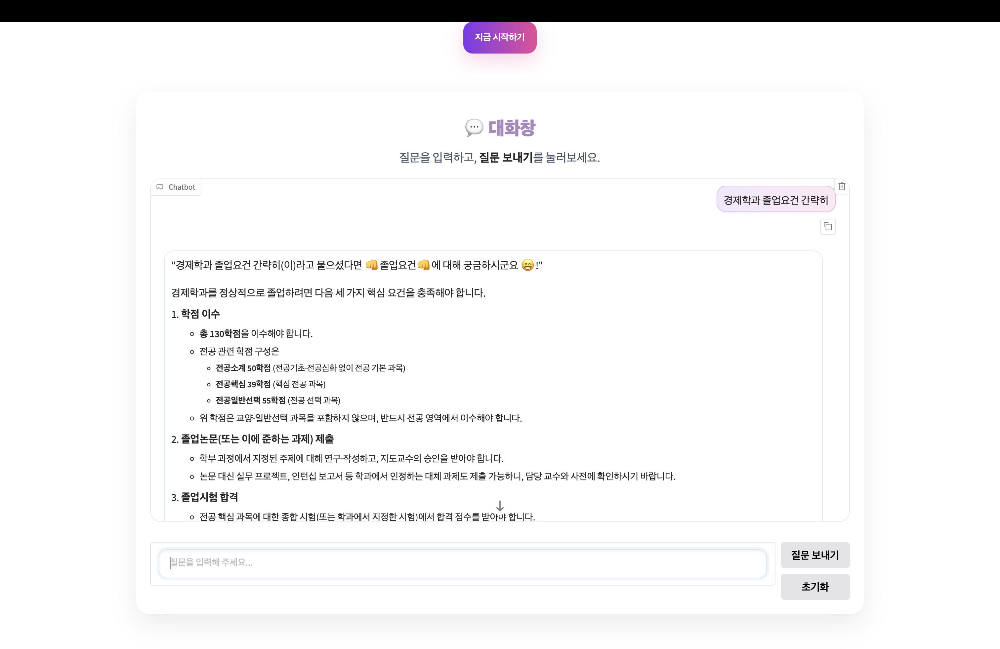
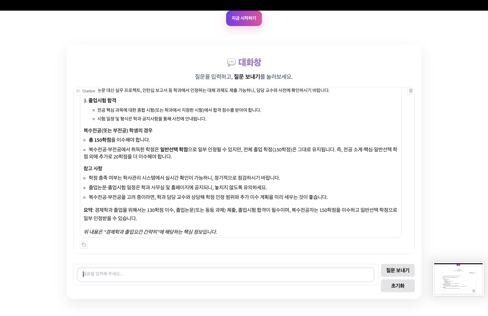
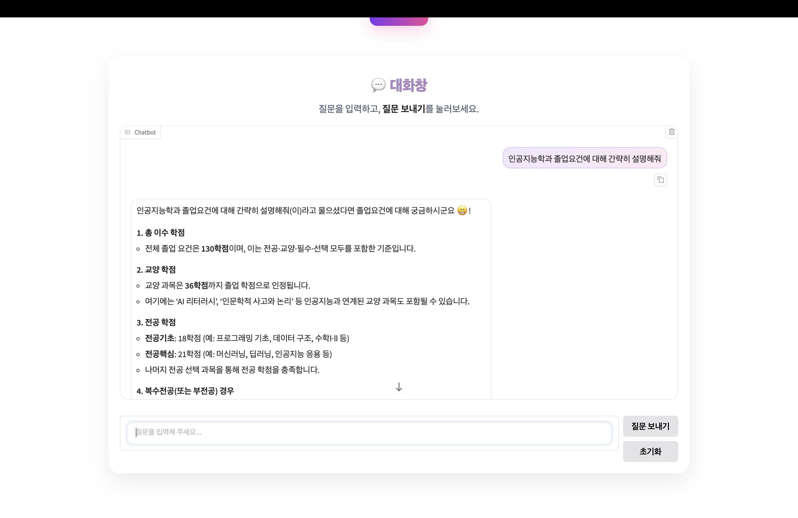
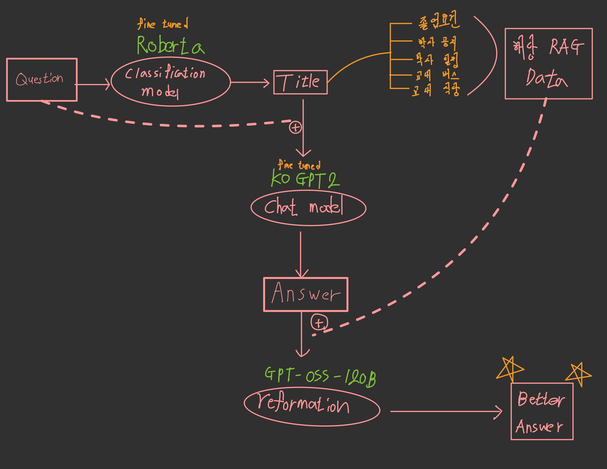

<br/>
<br/>

# 0. Getting Started
```bash
 git clone https://github.com/un1876/CNU_chatBot.git
 cd CNU_chatBot
 pip install -r requirements.txt
 cd src
 python cnuchatbot.py

```

[//]: # ([서비스 링크]&#40;https://club-project-one.vercel.app/&#41;)


# 1. Project Overview
- 프로젝트 이름: CNU 챗봇
- 프로젝트 설명: 교내 다섯 주제(졸업요건, 학사 공지, 학사 일정, 교내 버스, 교내 식당)에 대해 질의응답하는 챗봇 


# 2. Team Members (팀원 및 팀 소개)
|                 김동언                  |  최재영  |  최은서  |  
|:------------------------------------:|:-----:|:-----:|
|               PL,FE,BE               | DB,FE | DB,BE |
| [GitHub](hhttps://github.com/un1876) |       |       |

- Duration: 25.05 ~ 06

# 3. Key Features (주요 기능)

- **질문 분류**:
  - 질문 시 분류모델에서 다섯 주제 중 하나로 분류
- **질의 응답**:
  - 해당 분류된 질문에 대한 응답
  

# 5. Technology Stack (기술 스택)
## 5.1 Language
|            |                                                                                                                          |
|------------|--------------------------------------------------------------------------------------------------------------------------|
| HTML5      |       | 
| CSS3       |        |
| Javascript |  | 
| Python     |                                                              |
<br/>

## 5.2 Frotend
|        |                                                              |  |
|--------|--------------------------------------------------------------|----------------|
| Gradio |  |  5.34.1   |


<br/>

[//]: # ()
[//]: # (## 5.3 Backend)

[//]: # (|  |  |  |)

[//]: # (|-----------------|-----------------|-----------------|)

[//]: # (| Firebase    |      | 10.12.5    |)

<br/>

[//]: # (## 5.4 Cooperation)

[//]: # (|  |  |)

[//]: # (|-----------------|-----------------|)

[//]: # (| Git    |      |)

[//]: # (| Notion    |      |)

[//]: # ()
[//]: # (<br/>)

[//]: # (# 6. Project Structure &#40;프로젝트 구조&#41;)

[//]: # (```plaintext)

[//]: # (project/)

[//]: # (├── public/)

[//]: # (│   ├── index.html           # HTML 템플릿 파일)

[//]: # (│   └── favicon.ico          # 아이콘 파일)

[//]: # (├── src/)

[//]: # (│   ├── assets/              # 이미지, 폰트 등 정적 파일)

[//]: # (│   ├── components/          # 재사용 가능한 UI 컴포넌트)

[//]: # (│   ├── hooks/               # 커스텀 훅 모음)

[//]: # (│   ├── pages/               # 각 페이지별 컴포넌트)

[//]: # (│   ├── App.js               # 메인 애플리케이션 컴포넌트)

[//]: # (│   ├── index.js             # 엔트리 포인트 파일)

[//]: # (│   ├── index.css            # 전역 css 파일)

[//]: # (│   ├── firebaseConfig.js    # firebase 인스턴스 초기화 파일)

[//]: # (│   package-lock.json    # 정확한 종속성 버전이 기록된 파일로, 일관된 빌드를 보장)

[//]: # (│   package.json         # 프로젝트 종속성 및 스크립트 정의)

[//]: # (├── .gitignore               # Git 무시 파일 목록)

[//]: # (└── README.md                # 프로젝트 개요 및 사용법)

[//]: # (```)

[//]: # ()
[//]: # (<br/>)

[//]: # (<br/>)

# 6. 서비스 화면
  - 첫화면

  - 채팅
  
  
  - 추가 기능 -표현(ex.간략히)
  
  
  

# 7. 시스템 아키텍쳐



# 8. License
본 프로젝트의 UI 코드는 다음 오픈소스 프로젝트를 일부 참고/재사용했습니다:
- imgToVideo (MIT License) © 20XX Original Author

원본 라이선스 전문은 프로젝트 루트의 LICENSE 파일을 참고하세요.
일부 구성요소/이미지/폰트는 별도 라이선스를 따를 수 있습니다.


