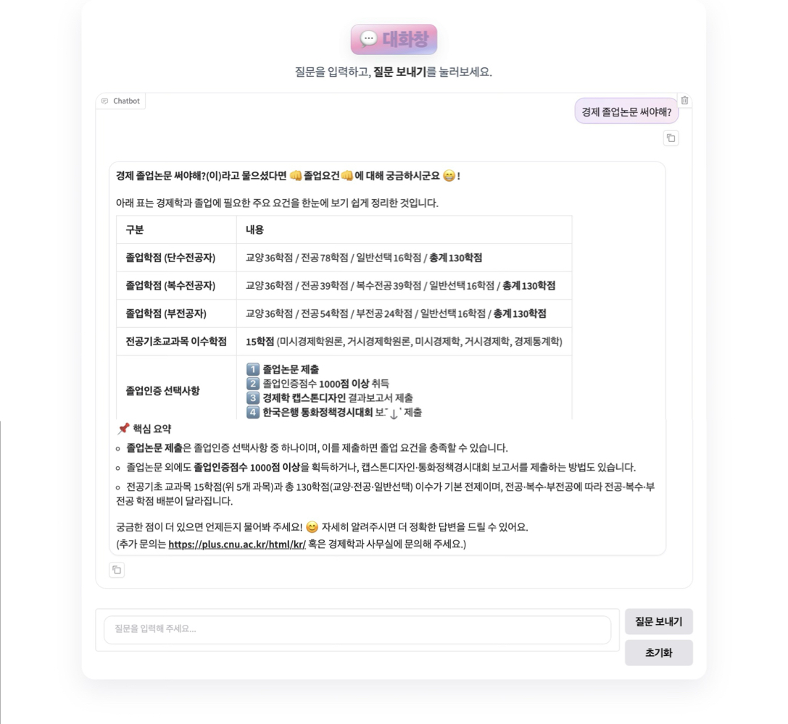
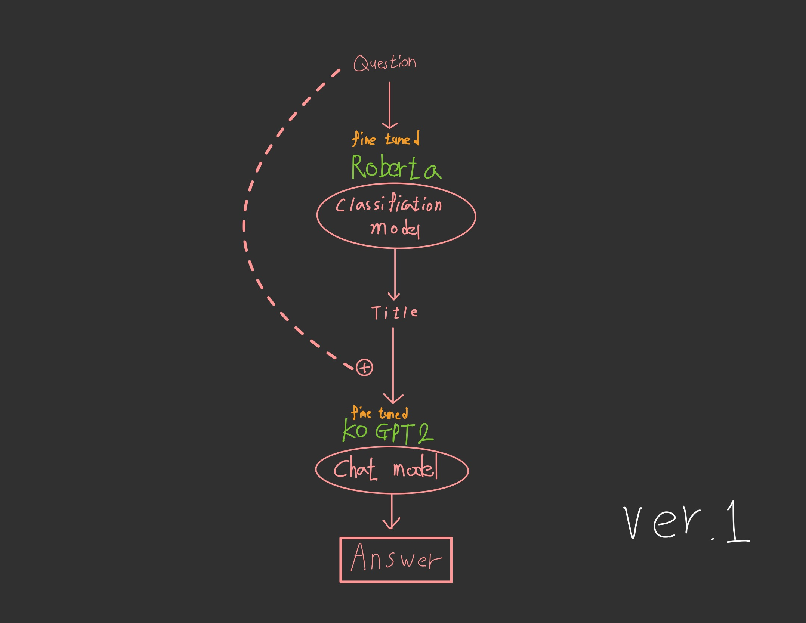
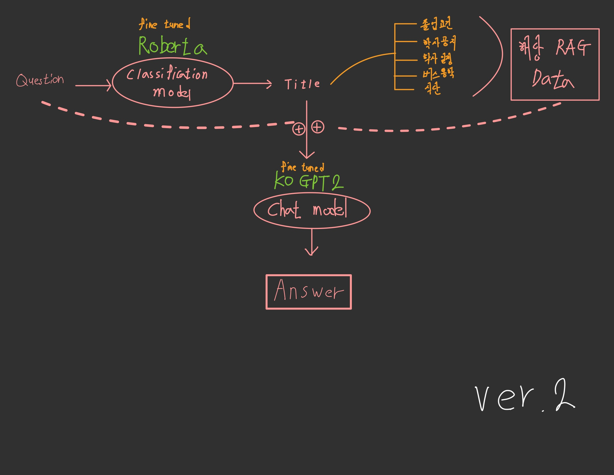
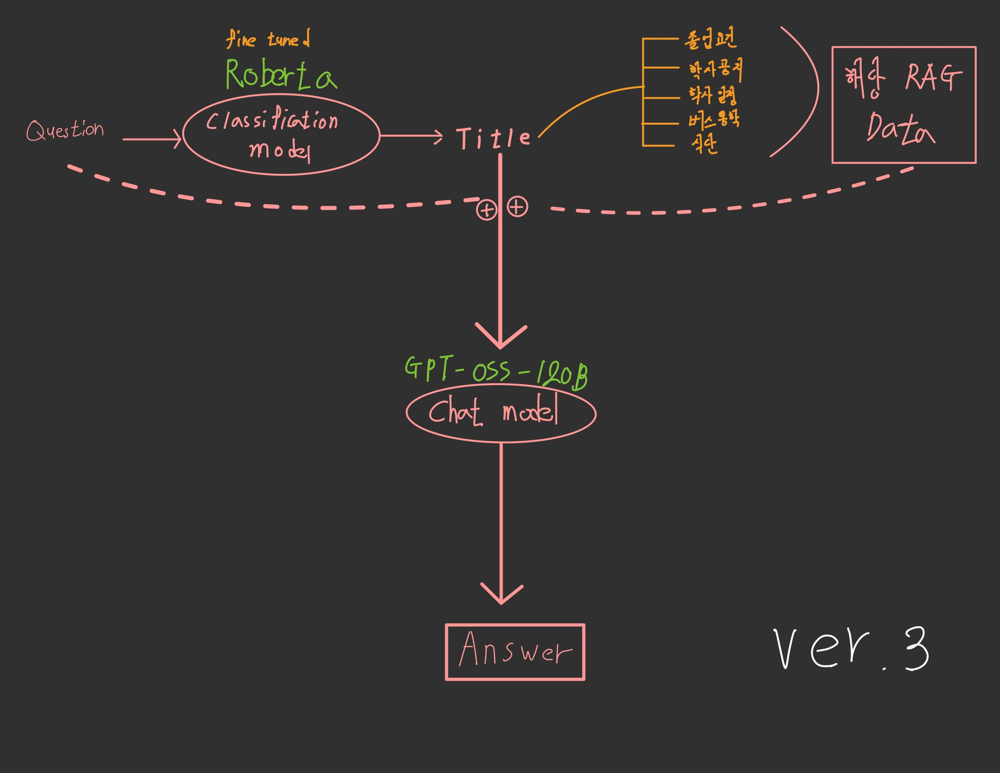

<br/>
<br/>

# 0. Getting Started
🙏 need : python>=3.11

  git clone
```bash
 git clone https://github.com/un1876/CNU_chatBot.git
 cd CNU_chatBot
```
  
  install & run
```bash

 pip install -r requirements.txt
 cd src
 python cnuchatbot.py

```


# 1. Project Overview
- 프로젝트 이름: CNU 챗봇
- 프로젝트 설명: 충남대학교(졸업요건, 학사 공지, 학사 일정, 교내 버스, 교내 식당)에 대해 질의응답하는 챗봇 


# 2. Team Members (팀원 및 팀 소개)
  ### ver 1, 2
|                 김동언                 |  최재영   |  최은서   |  
|:-----------------------------------:|:------:|:------:|
|               PL, BE                | DB, FE | DB, BE |
| [GitHub](https://github.com/un1876) |        |        |

  - Duration: 
    - ver 1,2 : 25.05 ~ 06
  ### ver 3
|                 김동언                 |  
|:-----------------------------------:|
|           PL, Full stack            |
| [GitHub](https://github.com/un1876) |

  - Duration:
    - ver 3: 25.10
# 3. Key Features (주요 기능)

- **질문 분류**:
  - 질문 시 분류모델에서 다섯 주제 분류
- **질의 응답**:
  - 해당 분류된 질문에 대한 응답
  

# 4. Technology Stack (기술 스택)
## 4.1 Language
|            |                                                                                                                          |
|------------|--------------------------------------------------------------------------------------------------------------------------|
| HTML5      |       | 
| CSS3       |        |
| Python     |                                                              |
<br/>

## 4.2 Frotend
|        |                                                              | 
|--------|--------------------------------------------------------------|
| Gradio |  |


<br/>

[//]: # ()
[//]: # (## 5.3 Backend)

[//]: # (|  |  |  |)

[//]: # (|-----------------|-----------------|-----------------|)

[//]: # (| Firebase    |      | 10.12.5    |)

<br/>

## 4.3 Cooperation

|      |  |
|------|-----------------|
| Git  |      |
| KakaoTalk |      |


<br/>

# 5. Project Structure (프로젝트 구조)

```plaintext

project/
├── public/ 
│   └── img                  # 이미지, 폰트 등 정적 파일
├── rag_data/                #  RAG 데이터
│   ├── bus/                        # 주제1. 버스
│   ├── ├── bus_route.json
│   ├── └── Daejon_BUS_all_stops.json
│   ├── caendar/                    # 주제2. 학사일정
│   ├── └── academic_calendar.json          
│   ├── graduation_requirements/    # 주제3. 졸업요건              
│   ├── └── graduation_RAG.json
│   ├── notice/                     # 주제4. 학사공지
│   ├── └── notice.json
│   ├── restaurant/                 # 주제5. 식단     
│   └── └── menu_1.json
├── src/
│   ├── academic_crawler.py         # 학사일정 크롤러
│   ├── chatbot_pipeline_ver1.py    # 챗봇 ver.1
│   ├── chatbot_pipeline_ver2.py    # 챗봇 ver.2
│   ├── chatbot_pipeline_ver3.py    # 챗봇 ver.3
│   ├── cnuchatbot.py               # 챗봇 실행 파일
│   ├── date_crawler.py             # 날짜 클로러
│   ├── menu_crawler.py             # 메큐 크롤러
│   └── notice_crawler.py           # 공지 크롤러
├── web/                    # gradio web page 코드
│   ├── page.css
│   └── page.html
├── .env                    # 환경 설정 파일
├── .gitignore
├── README.md               # 프로젝트 개요 및 사용법
└── requirements.txt        
```


<br/>

<br/>

# 6. 서비스 화면(ver 3 기준)
|        |                                      |                                                                                
|--------|--------------------------------------|
|  홈화면   |  |

|        |                                         |                                         |
|:------:|-----------------------------------------|-----------------------------------------|
|  졸업요건  |   |   |
| 버스/통학  |   |    |
|        |   |   |
|        |                |                                         |
| 학교공지사항 |  |  |
|  학사일정  |  |                                         |
|   식단   |  |              |


# 7. 시스템 아키텍쳐


### Inference Pipeline (v1)


1. **Roberta 분류**: 질문 → 토픽/타이틀 분류
2. **(fine-tuned)KoGPT2**: 컨텍스트 기반 응답 생성
3. **Answer**: 최종 응답 반환

### Inference Pipeline (v2)


1. **Roberta 분류**: 질문 → 토픽/타이틀 분류
2. **RAG 조회**: 토픽에 맞는 데이터 검색/주입(new)
3. **(fine-tuned)KoGPT2**: 컨텍스트 기반 응답 생성
4. **Answer**: 최종 응답 반환

limitation: (KoGPT2)작은 언어 모델로 인해 답변 퀄리티 미흡

### Inference Pipeline (v3)


1. **Roberta 분류**: 질문 → 토픽/타이틀 분류
2. **RAG 조회**: 토픽에 맞는 데이터 검색/주입
3. **GPT-OSS-120B**: 컨텍스트 기반 응답 생성
4. **Answer**: 최종 응답 반환
- (ver2->ver3) UPDATE List: 
  - (Fine-tuned 챗봇 모델)KoGpt-2모델 ->  GPT-OSS-120B 답변 퀄리티 개선 
  - R.A.G 데이터 추가 및 개선
  - 크롤링 추가 및 전격 개선
  - UI 변경   
  - 학교공지사항, 학사일정 분류 정확도 개선
  
# 8. License
본 프로젝트의 UI 코드는 다음 오픈소스 프로젝트를 일부 참고/재사용했습니다:
- imgToVideo (MIT License) © 20XX Original Author

원본 라이선스 전문은 프로젝트 루트의 LICENSE 파일을 참고하세요.
일부 구성요소/이미지/폰트는 별도 라이선스를 따를 수 있습니다.


